# 📝 Notes App — DevOps Portfolio Project (Flask + AWS)

Hi! I’m Nikita, a DevOps Engineer, and this is my personal project where I built and deployed a containerized note-taking web application with **Flask**, **PostgreSQL**, and using AWS services such as **ECS Fargate**, **RDS**, and **Application Load Balancer**. The project follows DevOps best practices including CI/CD with GitHub Actions.

---

## 🔗 Demo & Repository

- 📂 **Project Repository**: [github.com/nikita-butakov/notes_app_may2025](https://github.com/nikita-butakov/notes_app_may2025)

---

## 🛠️ Tech Stack

- ⚙️ **Flask** – Python web backend  
- 🐳 **Docker** – containerization  
- ☁️ **Amazon ECS (Fargate)** – serverless app hosting  
- 🛢️ **Amazon RDS (PostgreSQL)** – managed relational database  
- 📦 **Amazon ECR** – Docker image registry  
- 🔁 **GitHub Actions** – CI/CD automation  
- 🌐 **Amazon Route 53 / Cloudflare** – DNS and domain setup (domain steps not included in this repo)  
- 📊 **CloudWatch** – monitoring and logging  
- 🧱 **Application Load Balancer** – traffic distribution  
- 📶 **Target Group (TG)** – routes traffic to ECS tasks  
- 🔐 **Security Groups (SG)** – network access control  
- 🌍 **VPC with Private Subnets** – isolated backend infrastructure  

---

## 🧱 Infrastructure Overview

- ✅ **VPC** with public (for ALB) and private (for RDS) subnets  
- ✅ **Security Groups** for ALB, ECS Tasks, and RDS  
- ✅ **Application Load Balancer** with Target Group  
- ✅ **Amazon RDS** (PostgreSQL) with private subnet placement  
- ✅ **Amazon ECR** hosting backend and frontend Docker images  
- ✅ **ECS Fargate Cluster** running both containers  
- ✅ **CI/CD Pipeline** via GitHub Actions (auto-deploy on push)  
- ✅ **HTTPS** enabled with AWS ACM  
- ✅ **Domain** support via Route 53 or Cloudflare  

---

## 🔧 App Features

- 📝 Add, edit, and delete notes  
- 📡 REST API available at `/api/notes`  
- 🔐 Secure, scalable, stateless architecture  
- 🚀 Automated deployment pipeline  
- 📈 Monitoring and logging with CloudWatch  

---

## 🖼️ Architecture Diagram

📎 See the [Architecture Diagram](./architecture_diagram.pdf) for a full overview of services and flow.

---

## 📸 Screenshots

---

### ⚖️ Application Load Balancer

  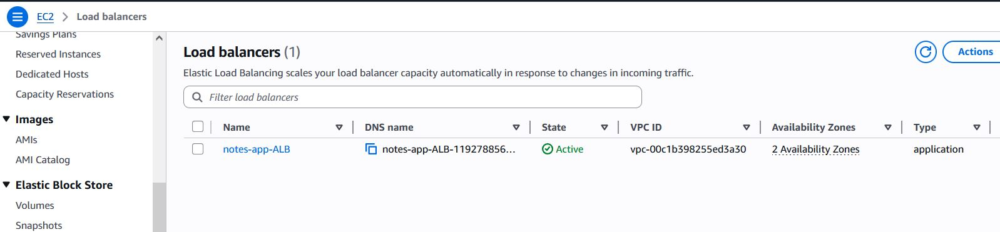
  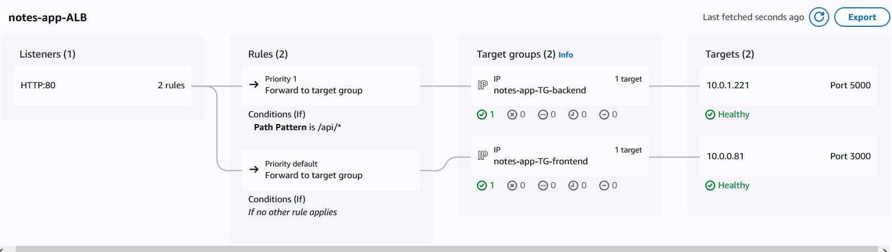

---

### 📦 Elastic Container Registry (ECR)

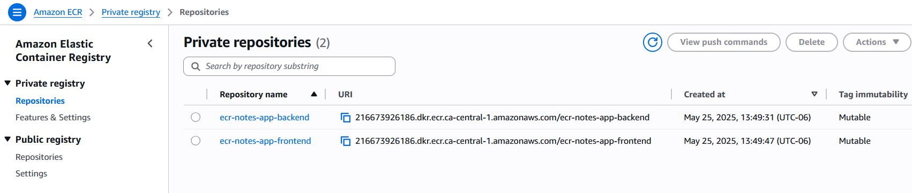

---

### 🐳 Elastic Container Service (ECS)

  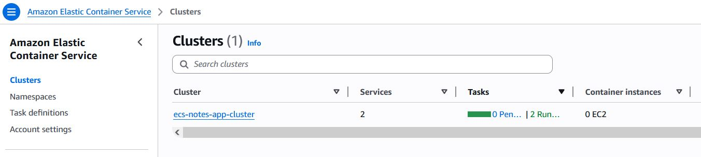
  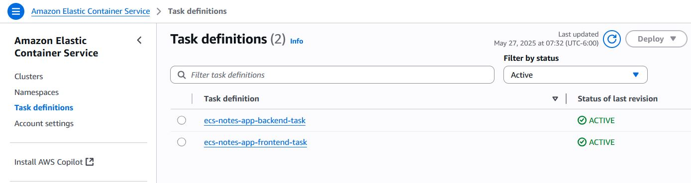
  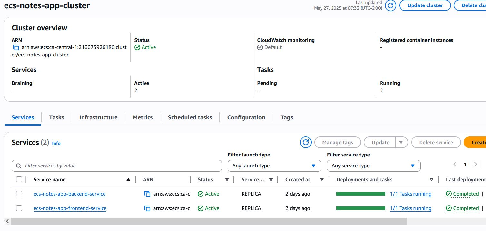

---

### 🛢️ Amazon RDS (PostgreSQL)

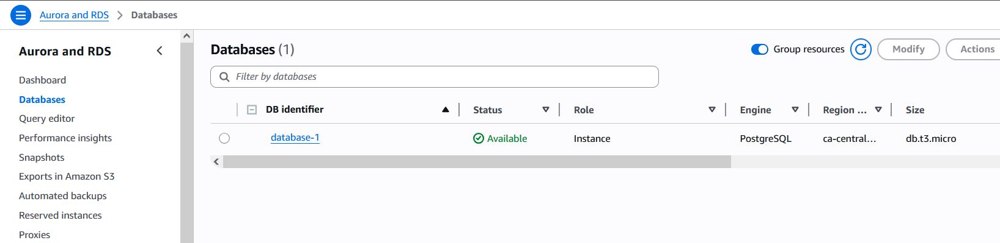

---

### 🌐 Networking (VPC, Subnets, SG, TG)

  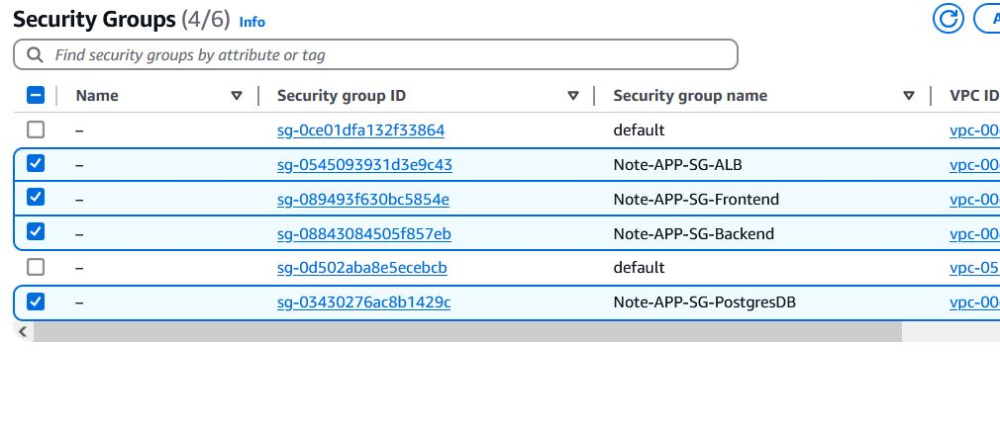
  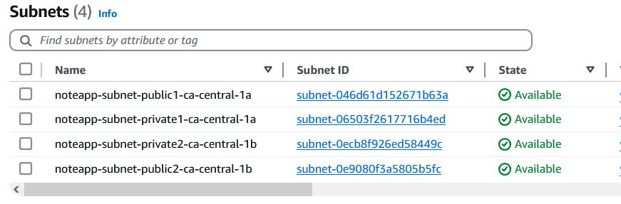
  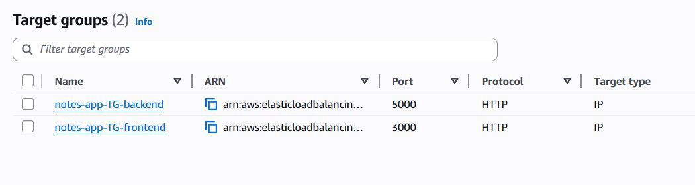
  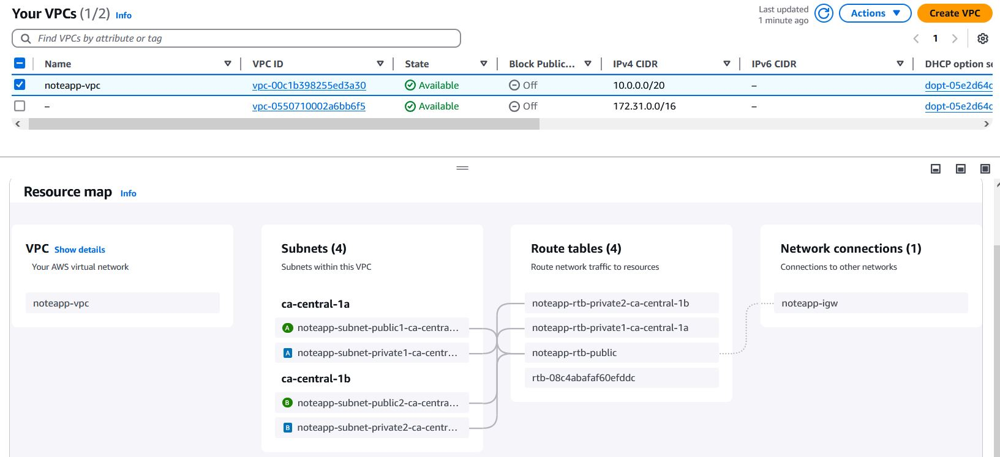

---

### 🔁 GitHub Actions (CI/CD)

  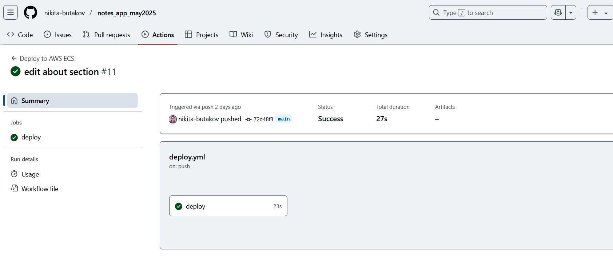
  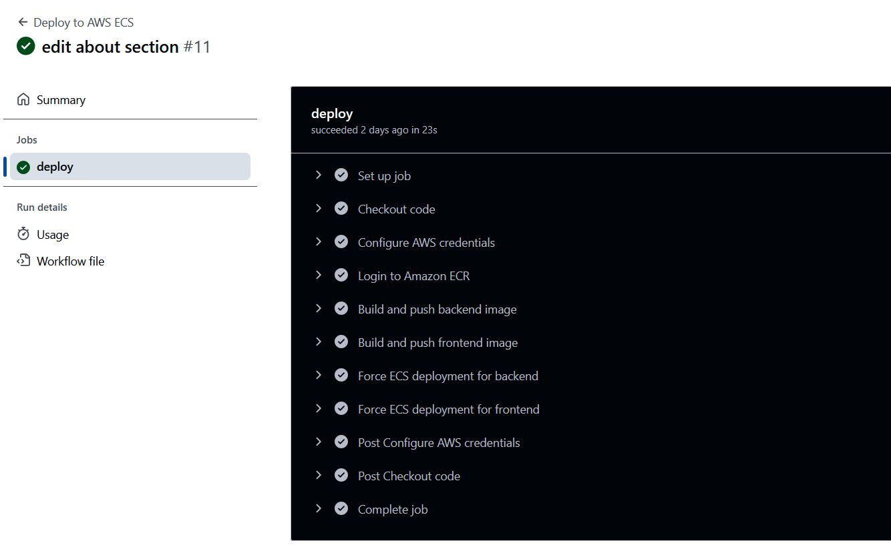

---

### 📝 Notes App Interface

  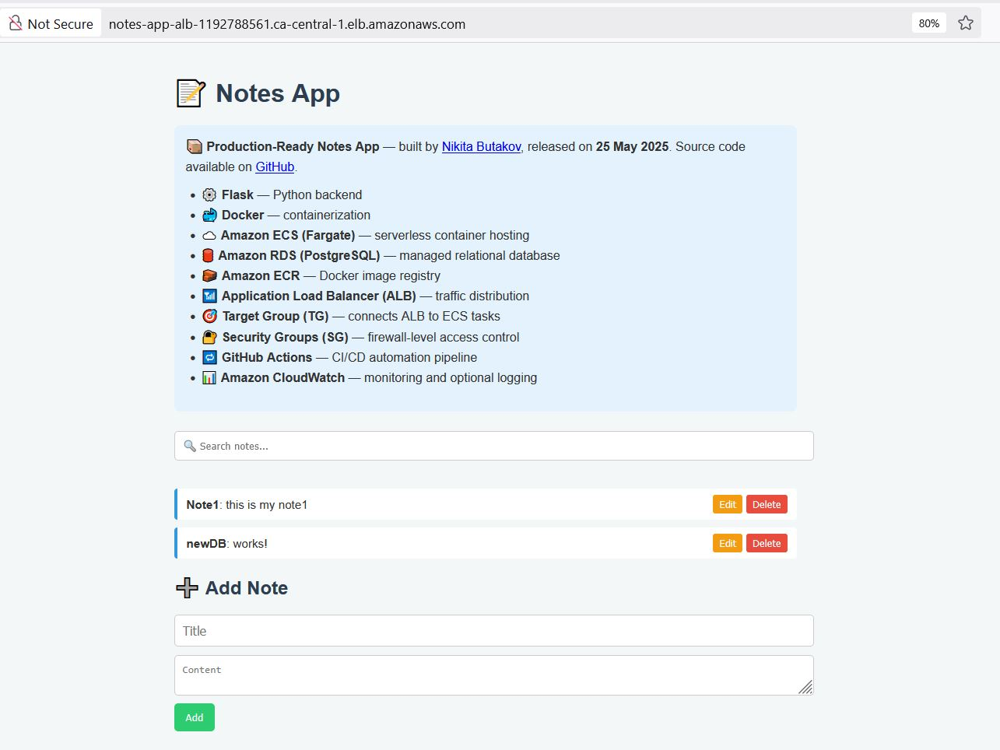
  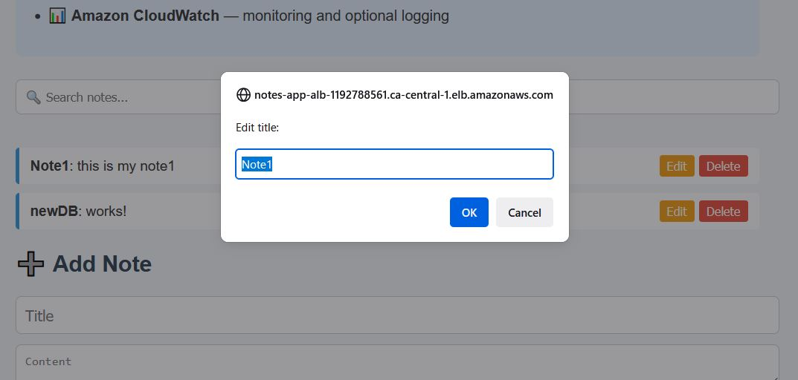

---

## 👤 Author

**Nikita Butakov**  
DevOps • Cloud • Automation

- 🔗 [LinkedIn](https://www.linkedin.com/in/nikita-butakov/)  
- 🐙 [GitHub](https://github.com/nikita-butakov)
